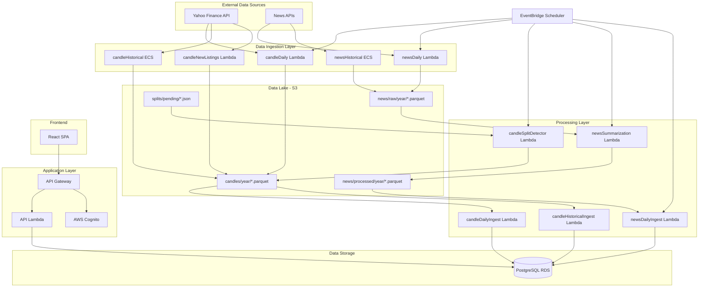

# Stocker - Production-Grade Stock Portfolio Management Platform

A full-stack, cloud-native stock portfolio management application with real-time data ingestion, AI-powered news aggregation, and comprehensive analytics. Built with modern engineering practices, this project demonstrates production-ready system design, scalable data pipelines, and cloud infrastructure expertise.

## Table of Contents

- [Overview](#overview)
- [Architecture & System Design](#architecture--system-design)
- [Technology Stack](#technology-stack)
- [Core Features](#core-features)
- [Infrastructure & DevOps](#infrastructure--devops)
- [Data Architecture](#data-architecture)
- [Engineering Practices](#engineering-practices)
- [Project Structure](#project-structure)
- [Development Setup](#development-setup)
- [Deployment](#deployment)

## Overview

Stocker is a comprehensive stock portfolio management platform that provides users with real-time market data, personalized news feeds, and portfolio analytics. The system processes millions of data points daily through automated ETL pipelines, maintains a data lake architecture for historical analysis, and delivers insights through an intuitive web interface.

**Key Highlights:**
- **Multi-service architecture** with 15+ microservices and Lambda functions
- **Event-driven data pipelines** processing stock candles and news articles
- **AI-powered news summarization** using OpenAI GPT models
- **Automated stock split detection and correction**
- **Production-grade infrastructure** on AWS with Infrastructure as Code
- **Type-safe full-stack** implementation with TypeScript

## Architecture & System Design

The system follows a service-oriented architecture with clear separation between data ingestion, processing, storage, and presentation layers. The architecture is designed for scalability, reliability, and cost-efficiency.

### High-Level Architecture



### Architecture Principles

1. **Separation of Concerns**: Clear boundaries between data ingestion, processing, storage, and presentation
2. **Event-Driven Processing**: EventBridge schedules and S3 triggers orchestrate data pipelines
3. **Data Lake Pattern**: S3 serves as the single source of truth with Parquet-optimized storage
4. **Rolling Window Processing**: 7-day rolling windows ensure efficient processing and storage
5. **Serverless-First**: Lambda functions for short-lived tasks, ECS Fargate for long-running historical loads
6. **Cost Optimization**: Auto-scaling, pay-per-use Lambda, and efficient data partitioning

### Monorepo Structure

The project uses a monorepo architecture with npm workspaces, enabling:
- Shared type definitions across frontend and backend
- Code reuse through internal packages
- Unified dependency management
- Coordinated deployments

## Technology Stack

### Frontend
- **React 19** - Latest React with concurrent features
- **TypeScript** - Full type safety across the application
- **Vite** - Fast build tool with HMR
- **TanStack Query** - Server state management and caching
- **TailwindCSS** - Utility-first CSS framework
- **shadcn/ui** - Accessible component library
- **Recharts** - Data visualization for portfolio analytics
- **Framer Motion** - Smooth animations and transitions

### Backend
- **Express.js 5** - Modern web framework
- **TypeScript** - Type-safe server code
- **Drizzle ORM** - Type-safe database queries with PostgreSQL
- **Zod** - Runtime validation and type inference
- **AWS SDK v3** - Modern, modular AWS client

### Infrastructure
- **AWS Lambda** - Serverless compute for API and data processing
- **AWS ECS Fargate** - Containerized long-running tasks
- **Amazon RDS PostgreSQL** - Managed relational database
- **Amazon S3** - Data lake storage with Parquet format
- **Amazon API Gateway** - RESTful API with Cognito integration
- **AWS Cognito** - User authentication and authorization
- **Amazon VPC** - Isolated network environment
- **Amazon EventBridge** - Event-driven orchestration
- **Terraform** - Infrastructure as Code

### Data Processing
- **Parquet** - Columnar storage format for efficient analytics
- **OpenAI API** - LLM-powered news summarization
- **Yahoo Finance API** - Market data ingestion
- **Batch Processing** - Efficient bulk operations

### DevOps & CI/CD
- **GitHub Actions** - Automated build and deployment
- **Terraform Cloud** - Infrastructure state management
- **Docker** - Containerization for ECS tasks
- **ECR** - Container registry

## Core Features

### 1. Real-Time Portfolio Tracking

Users can build and manage multi-stock portfolios with:
- **Real-time quotes** fetched from Yahoo Finance
- **Performance analytics** with gain/loss calculations
- **Interactive charts** showing portfolio value over time
- **Holding management** with purchase price and date tracking

**Technical Implementation:**
- Optimized database queries with Drizzle ORM
- Efficient caching with TanStack Query
- Real-time data updates via scheduled Lambda functions

### 2. Data Ingestion Pipelines

#### Historical Data Loading
- **ECS Fargate tasks** process years of historical stock data
- **Incremental processing** with checkpointing for resumability
- **Batch writes** to S3 in Parquet format for optimal storage

#### Daily Data Updates
- **EventBridge-triggered Lambda** functions run after market close
- **7-day rolling window** processing for efficient updates
- **Automatic deduplication** using composite primary keys

#### New Listings Detection
- **Automated ticker discovery** for newly listed stocks
- **Metadata extraction** including market cap, industry, exchange
- **Seamless integration** into existing data pipelines

### 3. Stock Split Detection & Correction

Automated system for detecting and correcting stock splits:
- **Daily scanning** of all tickers for recent splits
- **Two-phase processing**: Fetch → Apply pattern
- **Historical correction** of candle data affected by splits
- **Idempotent operations** ensuring data consistency

**Technical Highlights:**
- S3-based state management for split records
- Event-driven processing with S3 triggers
- Automatic adjustment of historical prices

### 4. AI-Powered News Aggregation

Intelligent news processing pipeline:
- **Multi-source aggregation** from various news APIs
- **LLM summarization** using OpenAI GPT models
- **Sentiment analysis** (positive/negative/neutral)
- **Token-aware batching** for efficient API usage
- **Fallback mechanisms** for API failures

**Processing Flow:**
1. Raw articles ingested and stored in S3
2. Summarization Lambda processes articles in batches
3. Summaries stored in Parquet format
4. Rolling window sync to RDS for fast queries
5. User-facing API serves personalized news feeds

### 5. Authentication & Authorization

Production-grade auth system:
- **AWS Cognito** for user management
- **JWT-based authentication** with secure token validation
- **Guest user support** for unauthenticated exploration
- **Role-based access control** (user, admin, guest)
- **Automatic guest cleanup** via scheduled Lambda

**Security Features:**
- VPC isolation for database access
- IAM roles with least-privilege principles
- Secure session management
- API Gateway integration for request validation
- **Multi-layered rate limiting** with AWS WAF and stage throttling

### 6. Admin Dashboard

Comprehensive analytics for system administrators:
- **User metrics** (signups, active users, page views)
- **System health** monitoring
- **Cost tracking** and budget alerts
- **Recent activity** logs

## Infrastructure & DevOps

### Infrastructure as Code

The entire infrastructure is defined in Terraform with a modular architecture:

**15+ Terraform Modules:**
- `vpc` - Network isolation and subnet configuration
- `cognito` - User authentication service
- `api` - API Gateway and Lambda function
- `database` - RDS PostgreSQL with VPC security
- `s3` - Data lake bucket with lifecycle policies
- `ecs_cluster` - Container orchestration
- `candleHistorical` / `newsHistorical` - ECS task definitions
- `candleDaily` / `newsDaily` - Scheduled Lambda functions
- `candleDailyIngest` / `newsDailyIngest` - S3-triggered processors
- `newsSummarization` - AI processing pipeline
- `candleSplitDetector` - Split detection and correction
- `guestUserCleanup` - Automated maintenance

### Network Architecture

- **VPC** with public and private subnets
- **Security groups** with least-privilege access
- **NAT Gateway** for outbound internet access from private subnets
- **VPC endpoints** for S3 access (cost optimization)

### Rate Limiting & DDoS Protection

Production-grade rate limiting implemented through a multi-layered approach:

**Layer 1: API Gateway Stage Throttling**
- **Burst limit**: 100 requests (allows short traffic spikes)
- **Rate limit**: 50 requests/second (sustained rate)
- Applies to all routes as baseline protection
- Prevents overwhelming the backend Lambda function

**Layer 2: AWS WAF Rate-Based Rules**
- **IP-based rate limiting** with different limits for authenticated vs unauthenticated users
- **Unauthenticated endpoints**: 100 requests per 5 minutes per IP
  - Protects public routes: `/api/auth/guest`, `/api/auth/signup`, `/api/stocks/search`
  - Prevents abuse from anonymous users
- **Authenticated endpoints**: 1000 requests per 5 minutes per IP
  - Applies to JWT-protected routes
  - Higher limit accommodates normal user activity while preventing abuse

**Implementation Details:**
- WAF Web ACL with REGIONAL scope attached to API Gateway stage
- CloudWatch metrics enabled for monitoring rate limit hits
- Automatic blocking with 429 Too Many Requests responses
- Configurable limits via Terraform variables

**Industry Standards:**
- Follows FAANG-level security practices
- Differentiated limits for authenticated/unauthenticated traffic
- 5-minute sliding windows balance protection with user experience
- Multi-layered defense-in-depth approach

### CI/CD Pipeline

Automated deployment via GitHub Actions:
1. **Build** - TypeScript compilation and bundling
2. **Test** - (Future: unit and integration tests)
3. **Terraform Plan** - Infrastructure change preview
4. **Terraform Apply** - Automated infrastructure updates
5. **Docker Build** - Container images for ECS tasks
6. **ECR Push** - Image registry updates
7. **ECS Deployment** - Service updates with zero downtime

### Cost Optimization

- **Lambda** for short-lived, event-driven tasks
- **ECS Fargate** auto-scales to zero when not in use
- **S3 lifecycle policies** for data archival
- **Parquet compression** reducing storage costs
- **VPC endpoints** eliminating NAT Gateway costs for S3 access
- **Reserved capacity** considerations for predictable workloads

### Monitoring & Observability

- **CloudWatch Logs** for all Lambda functions and ECS tasks
- **CloudWatch Metrics** for API Gateway and Lambda performance
- **Structured logging** with consistent formats
- **Error tracking** with detailed stack traces

## Data Architecture

### Storage Hierarchy

**RDS PostgreSQL is the primary data store** for all transactional and query operations. S3 serves as an **intermediary buffer layer** in a cost-optimized data pipeline architecture.

### Cost-Optimized Lambda → S3 → Lambda → RDS Pattern

The system uses a two-stage Lambda architecture to eliminate NAT Gateway costs:

**Stage 1: Internet-Facing Lambdas (No VPC)**
- Lambda functions that fetch data from external APIs (Yahoo Finance, news APIs)
- Deployed **outside VPC** to access internet directly (no NAT Gateway needed)
- Write raw/processed data to S3 in Parquet format
- Examples: `candleDaily`, `newsDaily`, `candleNewListings`

**Stage 2: VPC-Connected Lambdas**
- Lambda functions that need RDS access (in private subnets)
- Deployed **inside VPC** with security groups allowing RDS access
- Read from S3 via **VPC Endpoints** (free, no NAT Gateway required)
- Batch upsert data to RDS PostgreSQL
- Examples: `candleDailyIngest`, `newsDailyIngest`, `newsSummarization`

**Cost Savings:**
- **NAT Gateway elimination**: ~$32/month + data transfer costs saved
- **VPC Endpoints**: Free for S3 access from VPC
- **Trade-off**: Slight latency increase, but acceptable for batch processing

### S3 Data Lake Structure

S3 serves as an intermediary storage layer with organized partitioning:

```
s3://bucket/
├── candles/
│   └── year/
│       └── YYYY.parquet          # Partitioned by year for efficient queries
├── news/
│   ├── raw/
│   │   └── year/
│   │       └── YYYY.parquet      # Raw articles before summarization
│   └── processed/
│       └── year/
│           └── YYYY.parquet      # AI-summarized articles
├── splits/
│   ├── pending/
│   │   └── {ticker}-splits.json  # Pending split corrections
│   └── processed/
│       └── {ticker}-splits.json  # Applied splits (audit trail)
└── listings/
    └── current-listings.json     # Active ticker registry
```

### Storage Optimization

**Parquet Format Benefits:**
- **Columnar storage**: Enables efficient column-level queries and analytics
- **Built-in compression**: Snappy compression reduces storage by 70-90% vs JSON
- **Schema evolution**: Supports adding columns without rewriting entire files
- **Predicate pushdown**: Query engines can skip irrelevant data blocks

**Year-Based Partitioning:**
- **Efficient date range queries**: Only scan relevant year partitions
- **Parallel processing**: Process multiple years concurrently
- **Cost-effective archival**: Move old partitions to Glacier lifecycle policies
- **Incremental processing**: Process new data without touching historical partitions

### Data Processing Patterns

#### Rolling Window Processing

All ingestion pipelines use a 7-day rolling window:
- **Efficiency**: Only processes recent data
- **Consistency**: Handles late-arriving data
- **Cost**: Minimizes processing time and storage

#### Batch Processing

- **Bulk operations** for database writes
- **Chunked processing** for large datasets
- **Checkpointing** for resumable long-running tasks

#### Deduplication Strategy

- **Composite primary keys** in database (ticker + date)
- **Upsert operations** with conflict resolution
- **Idempotent Lambda functions** for safe retries

### Data Flow

**Complete Pipeline:**

1. **Ingestion (Internet-Facing Lambdas)**: External APIs → Lambda (no VPC) → S3 Parquet files
   - Lambda functions fetch from Yahoo Finance, news APIs
   - Write directly to S3 (no VPC, no NAT Gateway)

2. **Processing (VPC Lambdas via S3 Triggers)**: S3 PutObject events → Lambda (in VPC) → Transform
   - Lambda functions triggered by S3 events
   - Read from S3 via VPC Endpoint (free)
   - Process/transform data (e.g., AI summarization)

3. **Ingestion to Primary Store (VPC Lambdas)**: S3 → Lambda (in VPC) → RDS PostgreSQL
   - Lambda functions read from S3 via VPC Endpoint
   - Batch upsert to RDS (rolling 7-day window)
   - RDS is the source of truth for all queries

4. **Query Path**: Frontend → API Gateway → Lambda API (in VPC) → RDS → Response
   - All user-facing queries read from RDS
   - Fast, indexed queries with connection pooling
   - S3 is never queried directly by the API

**Why This Architecture?**
- **Cost**: Eliminates NAT Gateway (~$32/month + data transfer)
- **Security**: RDS in private subnets, only VPC Lambdas can access
- **Performance**: RDS optimized for transactional queries, S3 for batch processing
- **Scalability**: S3 handles large batch writes, RDS handles high-frequency reads

### Database Schema

**Core Tables:**
- `users` - User accounts with role-based access
- `stocks` - Stock metadata (ticker, company name, market cap)
- `candles` - Historical OHLCV data
- `holdings` - User portfolio positions
- `news_summaries` - AI-generated article summaries
- `page_views` - Analytics tracking
- `daily_metrics` - Aggregated system metrics

**Design Principles:**
- Foreign key constraints for data integrity
- Check constraints for business rule validation
- Indexes on frequently queried columns
- Timestamps for audit trails

## Engineering Practices

### Type Safety

- **TypeScript** throughout the entire stack
- **Strict mode** enabled for maximum type safety
- **Zod schemas** for runtime validation
- **Drizzle ORM** generates types from database schema
- **Shared domain models** between frontend and backend

### Domain-Driven Design

Clear separation of concerns:

```
packages/
├── domain/          # Business logic and entities
├── repositories/    # Data access layer
├── infra/           # External services and infrastructure
├── server/          # API layer and controllers
└── db/              # Database schema definitions
```

**Benefits:**
- Testability through dependency injection
- Maintainability with clear boundaries
- Reusability across different contexts

### Code Quality

- **ESLint** with TypeScript-aware rules
- **Consistent code style** across packages
- **Error handling** with proper error types
- **Logging** with structured formats
- **Documentation** in code comments

### Security Best Practices

- **VPC isolation** for database access
- **IAM roles** with least-privilege access
- **JWT validation** for all authenticated endpoints
- **Input validation** with Zod schemas
- **SQL injection prevention** via parameterized queries (Drizzle ORM)
- **Secrets management** via environment variables

### Scalability Considerations

- **Stateless API** design for horizontal scaling
- **Database connection pooling** for efficient resource usage
- **Caching strategies** with TanStack Query
- **Async processing** for long-running operations
- **Batch operations** to minimize database round trips

## Project Structure

```
Stocker/
├── client/                    # React frontend application
│   ├── src/
│   │   ├── components/       # Reusable UI components
│   │   ├── pages/            # Route components
│   │   ├── hooks/            # Custom React hooks
│   │   └── lib/              # Utilities and configurations
│   └── public/               # Static assets
│
├── packages/                 # Monorepo packages
│   ├── domain/               # Domain models and business logic
│   ├── db/                   # Database schema and migrations
│   ├── repositories/         # Data access layer
│   ├── infra/                # External services (AWS, APIs)
│   ├── server/               # Express API server
│   ├── bucketRepository/    # S3 data access layer
│   │
│   ├── candleDaily/          # Daily candle ingestion Lambda
│   ├── candleHistorical/     # Historical candle ECS task
│   ├── candleDailyIngest/    # S3 → RDS sync Lambda
│   ├── candleHistoricalIngest/ # Historical data ingestion Lambda
│   ├── candleNewListings/    # New ticker discovery Lambda
│   ├── candleSplitDetector/  # Split detection and correction
│   │
│   ├── newsDaily/            # Daily news ingestion Lambda
│   ├── newsHistorical/       # Historical news ECS task
│   ├── newsDailyIngest/      # News S3 → RDS sync Lambda
│   ├── newsHistoricalIngest/ # Historical news ingestion Lambda
│   ├── newsSummarization/    # AI summarization Lambda
│   │
│   └── guestUserCleanup/    # Maintenance Lambda
│
├── infra/                    # Terraform infrastructure
│   ├── modules/              # Reusable Terraform modules
│   └── envs/
│       └── main/            # Main environment configuration
│
├── shared/                   # Shared TypeScript definitions
└── .github/
    └── workflows/           # CI/CD pipelines
```

### Package Dependencies

**Internal Package Graph:**
- `server` → `domain`, `repositories`, `db`, `infra`
- `repositories` → `domain`, `db`
- `infra` → `domain`
- Lambda packages → `domain`, `infra`, `bucketRepository`, `repositories`
- `bucketRepository` → `domain`, `infra`

This dependency structure ensures:
- No circular dependencies
- Clear ownership boundaries
- Easy testing and mocking

## Development Setup

### Prerequisites

- **Node.js** 20+ and npm
- **PostgreSQL** 14+ (for local development)
- **AWS CLI** configured with appropriate credentials
- **Terraform** 1.11.0+
- **Docker** (for ECS task development)

### Local Development

1. **Clone the repository**
   ```bash
   git clone <repository-url>
   cd Stocker
   ```

2. **Install dependencies**
   ```bash
   npm install
   ```

3. **Set up environment variables**
   ```bash
   # Create .env files in relevant packages
   # See setup-guide.md for detailed configuration
   ```

4. **Start local database**
   ```bash
   # Using Docker
   docker run -d \
     --name postgres \
     -e POSTGRES_PASSWORD=password \
     -e POSTGRES_DB=stocker \
     -p 5432:5432 \
     postgres:14
   ```

5. **Run database migrations**
   ```bash
   cd packages/db
   npm run push  # Pushes schema to database
   ```

6. **Start development servers**
   ```bash
   # Frontend (from root)
   npm run dev

   # Backend (from packages/server)
   cd packages/server
   npm run dev
   ```

### Environment Variables

Key environment variables required:

**Frontend:**
- `VITE_API_URL` - API endpoint URL

**Backend:**
- `DATABASE_URL` - PostgreSQL connection string
- `COGNITO_USER_POOL_ID` - AWS Cognito user pool ID
- `COGNITO_CLIENT_ID` - Cognito app client ID
- `AWS_REGION` - AWS region for services
- `S3_BUCKET_NAME` - S3 bucket for data lake
- `OPENAI_API_KEY` - OpenAI API key for summarization

**Infrastructure:**
- `TF_VAR_master_password` - RDS master password
- `TF_VAR_region` - AWS deployment region
- `AWS_ACCESS_KEY_ID` - AWS credentials
- `AWS_SECRET_ACCESS_KEY` - AWS credentials

## Deployment

### Infrastructure Provisioning

1. **Initialize Terraform**
   ```bash
   cd infra/envs/main
   terraform init
   ```

2. **Plan infrastructure changes**
   ```bash
   terraform plan
   ```

3. **Apply infrastructure**
   ```bash
   terraform apply
   ```

### CI/CD Deployment

The GitHub Actions workflow automatically:
1. Builds and packages the API Lambda function
2. Validates Terraform configuration
3. Provisions/updates AWS infrastructure
4. Builds and pushes Docker images to ECR
5. Updates ECS services with new images

### Manual Deployment Steps

For Lambda functions:
```bash
cd packages/server
npm run package  # Creates lambda.zip
# Upload to Lambda via AWS Console or CLI
```

For ECS tasks:
```bash
# Build and push Docker image
docker build -t candle-historical ./packages/candleHistorical
aws ecr get-login-password | docker login --username AWS --password-stdin <ecr-url>
docker tag candle-historical:latest <ecr-url>:latest
docker push <ecr-url>:latest

# Update ECS service
aws ecs update-service --cluster <cluster> --service <service> --force-new-deployment
```

### Monitoring Deployment

- **CloudWatch Logs**: Monitor Lambda execution logs
- **ECS Service Events**: Track container deployments
- **API Gateway Metrics**: Monitor API performance
- **RDS Performance Insights**: Database query analysis

---

## Technical Decisions & Trade-offs

### Why Parquet over JSON?
- **Storage efficiency**: 70-90% compression vs JSON
- **Query performance**: Columnar format enables efficient analytics
- **Cost**: Reduced S3 storage and transfer costs
- **Trade-off**: Requires Parquet libraries, but benefits outweigh costs

### Why Lambda + ECS Hybrid?
- **Lambda**: Perfect for short-lived, event-driven tasks (API, daily ingestion)
- **ECS Fargate**: Necessary for long-running historical data loads (15+ minutes)
- **Trade-off**: More complex infrastructure, but optimal cost and performance

### Why Rolling Window Processing?
- **Efficiency**: Only processes recent data, not entire history
- **Cost**: Minimizes Lambda execution time and database writes
- **Trade-off**: Slight complexity in window calculation, but significant savings

### Why Monorepo?
- **Type sharing**: Seamless TypeScript types across packages
- **Dependency management**: Single source of truth for versions
- **Coordination**: Easier to make cross-package changes
- **Trade-off**: Larger repository, but better developer experience

---

**Built with modern engineering practices, production-grade infrastructure, and a focus on scalability, reliability, and maintainability.**
